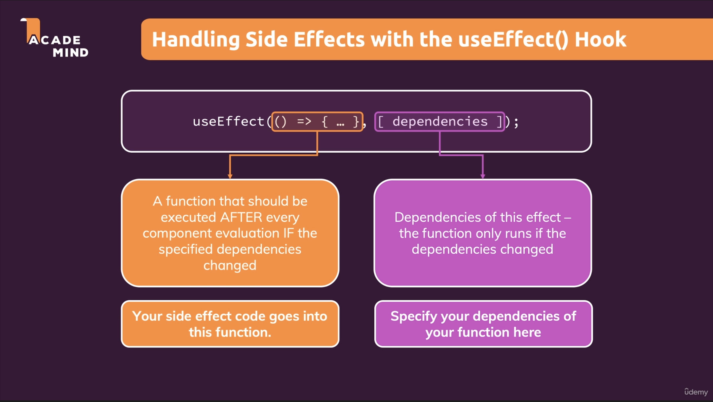

- You should add "everything" you use in the effect function as a dependency - i.e. all state variables and functions you use in there.
- You must add all "things" you use in your effect function if those "things" could change because your component (or some parent component) re-rendered.
- Exceptions:
    - state updating functions
    - built-in APIs or functions
    - variables (not some state or a prop) or functions you might've defined OUTSIDE your components
- useEffect hook generally runs after every component render cycle including first time the component is mounted.
- No dependencies make useEffect function runs after every component render cycle including first time the component is mounted.
- Empty array [] make useEffect function runs only one time which is the first time the component is mounted.
- [dependency] make useEffect function runs whenever the component is re-evaluated AND this dependency (only this one) changed.

- useEffect Cleanup function:
    - This is written inside useEffect block
    - runs before useEffect function code except for the first time, it doesn't run.
  ```
  return () => {
    console.log("Effect Cleanup!")
  }
  ```